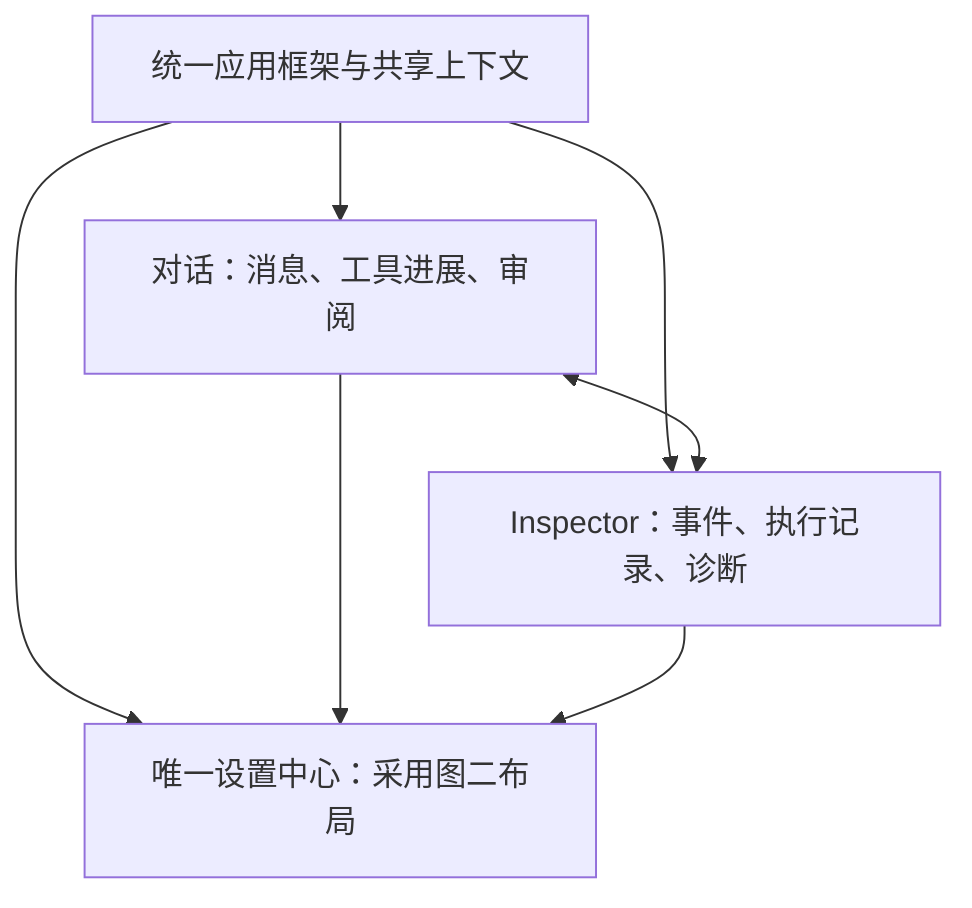

# 对话、Inspector 与统一设置：结构评估

> 历史批次记录：状态仅对应文内日期。当前验收边界见 [公开审阅说明](UX_PUBLIC_REVIEW_STATUS.md)；本地日志、截图与安装包未纳入公开分支。

日期：2026-09-11。依据用户提供的四张原生截图及方案形成时的实施树源码。用户先要求分析并行视图/统一设置的合理性，随后提出重构旧 Inspector，使风格布局与新版一致，最后明确“开始重构吧”。**本方案的统一应用框架、主 Inspector 与设置现已实施并完成限定验收，详见 [实施验收与试用包](UX_SHARED_SHELL_VALIDATION.md)。** 以下原因和源码行号记录的是重构前状态，保留为设计依据，不能当作当前仍有两套应用入口。Windows 原生高 DPI、其他高级诊断子面板与完整产品剩余项仍按验收报告区分。

## 判断

建议采用：同一应用框架内，对话与 Inspector 是可直接切换的两个同级视图；共同进入一个采用图二布局的设置中心。对话仍是默认主要入口，Inspector 是高级检查视图。同级路由不要求两者在导航中占同等视觉权重。

图二和图三属于新版对话界面，图一与图四属于旧工作台。当前把整套旧工作台作为“完整 Inspector”，保留高级能力有迁移价值，但已形成用户可见的导航、设置与状态割裂。这是前端迁移未收敛的结构问题，不能据此推断后端必须重写或所有功能重复实现。

## 已核实的原因

1. `web/src/App.tsx:116` 根据 `/legacy` 路径切换 `V2WorkbenchEntry` 和 `ConnectedWorkbench`，是两套界面组件树。`web/src/v2/app.tsx:64` 的完整 Inspector 入口经 `web/src/legacy-route.ts:21` 执行同文档 pushState，换入旧壳；并非独立的新应用进程。
2. `web/src/App.tsx:505` 的返回箭头在旧工作台 workspace 状态下直接禁用，仅 `setSurface("workspace")`；设置页的返回同样只退回旧工作台（562行）。这证实完整 Inspector 缺少显式返回新版对话的入口。新版轻量 Inspector 抽屉本身有关闭按钮，不能把抽屉和完整页面混为一谈。
3. 两套设置分别为 `components/settings-view.tsx` 与 `v2/components/settings.tsx`。主题已共用 `lib/appearance.ts` 和 `prayu.theme`；重复的是入口、渲染与部分前端状态，不应另建配置存储。
4. 旧设置的语言使用 `useLocale/setLocale`，新版常规页直接显示“简体中文”，新版大量文案也是硬编码中文。统一时须处理语言能力一致性，不能只复制 English 按钮就声称完整双语。
5. `web/src/v2/app.tsx:157` 的草稿属于 V2Workbench 的 React state。完整 Inspector 切换卸载该组件，具有丢失未发送草稿/新建对话临时选项的明确源码风险；本轮未在用户原生任务上制造草稿重现。修复范围应包括视图切换状态保留。

## 建议的信息结构



顶栏、窗口控制、当前项目/任务上下文和设置入口统一；两种视图的内容与信息密度保留差异。Inspector 应成为视图入口，不再只能从设置中的分类进入。全局“对话 / Inspector”切换保持同一个 Thread，事件详情仍可指向特定历史 Run，不能把历史执行切换误当成新建/恢复/重新执行任务。

设置从对话进入时返回原对话，从 Inspector 进入时返回原 Inspector；保留原任务与选中记录。显式视图切换不依赖“浏览器有一条上一页”。直接打开或刷新 Inspector 也应有可预测的返回目标；无当前 Thread 时显示全局诊断或明确的选择提示。

## 统一设置的范围

| 设置类型 | 建议位置与约束 |
| --- | --- |
| 应用全局 | 外观、可实际支持的语言、快捷键、关于/诊断连接信息；两入口读写同源。 |
| 模型与集成 | 供应商配置、凭据管理、模型目录、Skill/插件等进入同一设置中心；当前对话选择哪个模型仍是该对话的操作，不能误作全局模型替换。 |
| 项目/任务相关 | 执行环境、信任、网络和审批权限明确显示所作用的项目/Thread。无选择时不能暗中修改上次 Run；切换视图不得改变权限。 |
| Inspector 显示偏好 | 事件筛选、技术细节、布局密度在统一中心按高级项组织；不再附带另一套全局设置。 |

旧页的 MCP、Code Intel、Plugin 管理、Skill 安装及高级模型配置应先盘点后迁入同一框架；保留原服务端能力判断与确认流程。看似存在的侧栏类别不一定都有可执行功能，避免照抄占位页。原图二也需要调整：将“常规”重复的任务权限摘要整理到明确的权限入口，而非仅把旧页视觉替换。

独立只读核对补充：`v2/components/execution-settings.tsx:4` 已直接复用旧 `ExecutionProfilePanel` / `ExecutionInteractionPanel`，可继续组合这些有效组件。旧 `settings-view.tsx:81` 的 Skill 安装及 451 行起 Code Intel/MCP/plugin 精确指纹管理有实际能力；旧 `model-availability-dialog.tsx` 的命名全局模型路由与价格快照也不等同于新版供应商 CRUD/资格检测，迁移时需保留其有效用途。旧“本地账户”展示卡和静态快捷键列表不应被当作已经具备完整账户系统或快捷键编辑器。

状态一致性也须统一：旧任务权限使用 `[thread,id,execution-permission]`，V2 使用 `[v2,thread,id,permission]`，虽操作同一后端接口，查询缓存仍分开；切视图可能出现陈旧显示，应统一 query key 或失效规则（本轮为源码风险，未新做动态复现）。主题/语言/密度是本地 UI 偏好，其中旧密度样式还未覆盖整个 V2；执行环境属于具体任务，Debug 原生重启属于会话能力；扩展禁用还可能作用于注册表/指定安装，不能把以上操作全部包装为当前 Thread 独立设置。

## 实施建议与验收

### 最新补充：同时重构 Inspector 内容

建议采纳用户的进一步想法：把旧 Inspector 的有效功能迁入新版应用框架，同时重整它的信息层级和操作方式。这与上文的并行视图、统一设置是同一个改造。对话负责日常任务交流，Inspector 负责定位执行问题、检查记录和查看高级细节；字体、颜色、控件、导航和状态语义统一，Inspector 可以保留更高的信息密度。

源码与截图核实的问题：

| 问题 | 证据与判断 | 重构目标 |
| --- | --- | --- |
| Inspector 承载整套旧应用 | `App.tsx:496` 起保留旧顶栏、主导航、设置和资源工作区；`workbench-dock.tsx:149` 起又叠加工作区工具栏。 | 共用 V2 应用外壳、项目/任务侧栏和设置。Inspector 内只放当前检查内容与必要工具。 |
| 标签与点击结果不对应 | `App.tsx:513–519` 的“文件”直接新建 Thread、“编辑”切模型、“帮助”开设置，按钮没有相应菜单结构。 | 使用描述真实操作的按钮；只保留实际具备内容的菜单。 |
| 首屏重复说明身份、留给记录的空间不足 | `thread-workspace.tsx:149–173` 依次显示 Thread ID、标题、稳定身份、输入枚举、四列摘要和控制条，随后 `thread-transcript.tsx:75–86` 又显示记录标题与技术说明。 | 紧凑任务标题和实时状态，ID/Run 次数等移入概览或详情；让事件列表成为主体。 |
| 生命周期状态容易被理解为正在执行 | `thread-workspace.tsx:170` 直接展示 active/last Run.status；V2 另从 Thread execution 读取当前工作轮状态。 | 当前“正在工作/等待批准/空闲/停止中”等以实际执行状态为依据；Run 生命周期单独标明，状态读取失败则显示未知。查看旧记录不能把历史状态冒充当前状态。 |
| 输入操作已有两条不同路径 | `thread-workspace.tsx:212–237` 自行串联 submitThreadMessage → start/resume → executeRun(max_steps:1)；`v2/use-thread-turn.ts:40–57` 使用统一 turn 提交和原 key 核对。 | 若 Inspector 允许补充消息，复用新版提交控制器和同一 Thread 草稿/引用/错误归属；收敛旧独立编排。不得在新 Inspector 中重新实现第三套发送流程。 |
| 长记录的技术字段与正文争夺注意力 | 旧记录区默认反复显示来源、阶段、时间、序号和模型内容说明；样式还存在 9–11px 的辅助文字。 | 列表突出事件、简明结果、耗时/时间；来源仍可区分，精确 ID、参数、原始数据和细节按需展开。字号基于新版现有体系并实际检查，不能用缩小文字换信息密度。 |

旧页有真实基础应保留：分页加载、实时与落盘记录合并、Run 边界、动态高度虚拟列表、上翻加载的位置保持和接近底部才跟随最新（`thread-transcript.tsx:97–170、213–339`）。现有 Run 边界只是分隔行；长文本的折叠也只是展开已有 detail 字符串（421 行起），没有按工作轮/工具调用折叠、来源/失败筛选、搜索或“回到最新”按钮。旧详情还明确隐藏工具参数/原始输出，不能称其已经提供完整执行详情。可复用 V2 `components/activity-detail.tsx:482` 起按需读取的结构化详情，保留公开字段、脱敏与精确引用边界，不为迁移扩大数据可见范围。高级检查仍需能核实模型公开内容与执行事实的来源差异；减少重复说明不等于抹去差异或改变原始记录。

建议布局（示意，不是已经实现的 UI）：

```text
统一顶栏 / 窗口控制
项目与任务侧栏 │ 任务标题       [对话 | Inspector]       [设置]
               │ 当前执行状态    [运行记录选择]   [必要的任务操作]
               │ [全部 / 工具 / 审批 / 异常]      [在已加载记录中查找]
               │ 事件列表                         │ 选中事件详情
               │ 事件名称 · 结果 · 时间            │ 参数 / 输出 / 精确标识
               │ 按已知边界组织、可展开             │ 可复制，技术数据按需展开
```

右侧详情默认按需打开，窄窗口使用有返回/关闭的详情层，不强塞三栏。事件列表与详情各自滚动，避免在主列表内部再套同方向滚动区；命令输出这类必要长内容可单独滚动。切视图、开设置、查看详情都保留任务和阅读位置，实时新事件不强行把正在阅读历史的人拉回底部。

筛选/查找首批只针对已加载记录，并明确覆盖范围及继续加载入口；没有索引与服务端查询证据时不能包装成全历史全文搜索。当前待审批、提交结果未知或停止失败等需要处理的状态保留在共享状态区，不能被事件过滤器藏掉。历史 Run 的选择用于查看；修改当前任务的操作必须明确目标，不随历史选择暗中转移权限。

组织记录先使用已有可信身份和 Run 边界。只有记录能精确关联工作轮时才按 Turn 分组；model attempt/tool round 不等于用户工作轮，不根据相似正文或邻近时间猜测关联。一个工具可呈现简短摘要及阶段展开，但所有原记录、失败和引用仍可追溯。详情中的命令与保存输出复用现有专用组件，继续保留真实退出码、截断/脱敏说明及旧乱码记录。

输入区建议收敛到共享任务操作区：日常对话沿用完整编辑器，Inspector 可按需展开同一个编辑器；同一时刻只有一个活跃发送入口。审批、停止、排队和未知提交确认共用现有能力与状态来源。旧页有用的运行控制仍可作为显式高级操作进入，但不得代替普通发送流程，也不得因切换页面触发控制请求。

### 交付顺序与控制范围

先在现有 React 应用内收敛路由、应用框架与共享上下文，再把已有 Inspector 内容组件接入，最后迁移设置功能并去除旧设置壳。保留必要旧地址兼容。复用现有 API、连接 store、主题函数和功能组件，工作重点是前端组合与状态所有权。

具体分三步收敛：先让往返导航、唯一设置入口、任务状态与发送行为一致；再调整 Inspector 标题/状态、记录列表和按需详情；最后迁完有用高级入口并删除已失去用途的旧外壳和样式。若某项高级能力尚未迁移，明确留下可回来的临时兼容入口，不能仅隐藏后宣布统一完成。优先使用现有组件和列表基础，不另建通用面板平台、配置存储或日志系统；如遇 API 缺失，先列明具体用户需求和现有字段不足，再决定最小接口调整。

最低验收路径：

1. 对话 → Inspector → 对话，任务不变；草稿、引用、滚动位置和选中事件按所属视图保留。
2. 两个视图进入同一设置页；保存主题/模型配置后，两个视图显示一致；返回各自来源。
3. Inspector 直接打开、刷新、无任务、窄屏及侧栏收起时都有明确出口；顶栏按钮名称与实际行为一致。
4. 待审批和正在执行时切换视图不自动批准、停止、新建 Run 或重放请求；未知提交仍按原 key 核对，不能因组件卸载丢掉确认状态。
5. 旧页有效设置逐项有新入口；项目/Thread 权限显示精确作用域；迁移前后后端存量任务和配置不被改写。
6. Inspector 的当前执行状态与对话一致；空闲/运行/等待批准/读取失败/停止失败均准确。选择历史记录只改变阅读范围，所有可写操作说明精确目标。
7. 事件筛选和详情展开不丢原始失败、阶段、工具结果或来源；已加载范围明确，待审批等共享操作提示不被过滤。新增记录、加载更早记录和视图往返保持合理阅读锚点。
8. 按实际改动选择关键 UI 回归：1440、1036、800、390 宽度的布局，浅/深色、键盘焦点及详情关闭；Windows 实际 DPI 验收仍单列，不能用浏览器缩放替代。复用现有基础测试，增加导航/状态/请求身份等关键回归，不为样式细节叠加大批重复快照或无关全仓测试。

上述八项是本次结构改动的验收约定。方案形成时仅核对源码和截图；用户随后授权实施，当前已完成统一入口、主 Inspector、设置迁移及相应回归/浏览器验收。具体覆盖和边界见实施验收，不能将组件测试等同所有真实外部写流程或原生高 DPI 验收。用户正在试用的原生窗口未被操作，本阶段未启动产品模型或运行产品命令。
